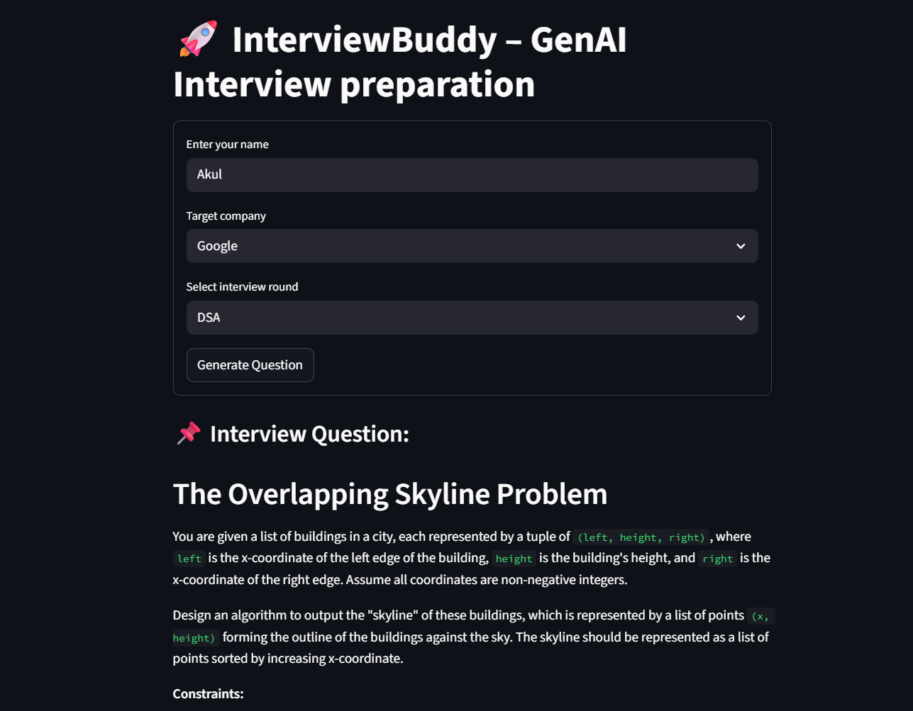
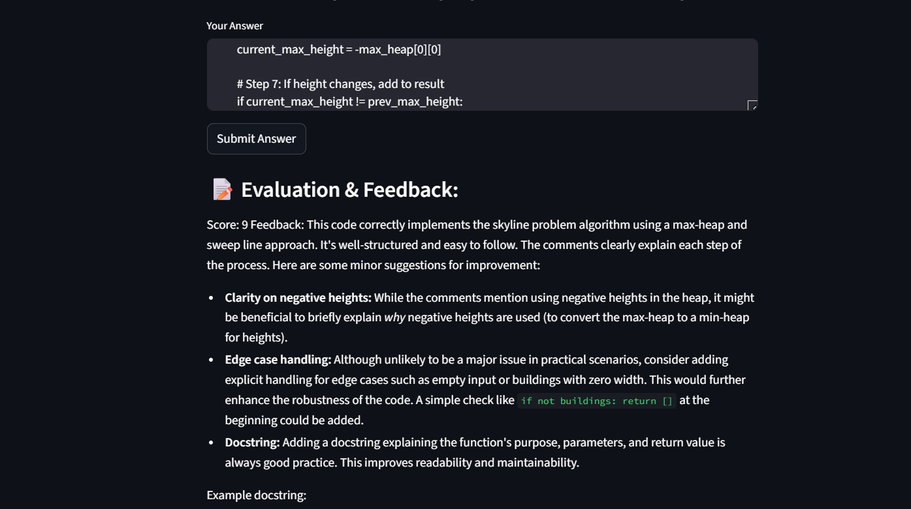

# 🤖 InterviewBuddy – GenAI Interview Preparation

**InterviewBuddy** is an AI-powered mock interview assistant built using **Google Gemini**, **Streamlit**, and **LangGraph**. It helps candidates practice and improve their interview skills by simulating realistic technical and behavioral rounds, evaluating answers with AI, and offering feedback — all in a clean, intuitive interface.

---

## 🚀 Features

- 🎯 **Role & Company-specific Questions**: Choose your target company and round type (e.g., DSA, System Design, ML, Cloud Architecture, HR) to get highly relevant questions.
- 🧠 **Experience-Aware**: Questions are tailored based on your experience level (Beginner to Intermediate).
- ✍️ **AI-Generated Questions & Feedback**: Powered by Google Gemini Pro for generating interview questions and scoring your answers.
- 📊 **Scoring System**: Receive a score from 1 to 10, along with personalized feedback.
- 📚 **Session History**: Track and view all your Q&A interactions within the session.
- 📥 **CSV Export**: Download your full interview session log as a CSV file.
- 🗂 **Persistent Logging**: All responses and feedback are logged locally for reference.

---

## 🖼️ UI Preview

| Home Page | Evaluation Feedback |
|-----------|---------------------|
|  |  |
---

## 🧠 How It Works

1. Enter your name, target company, interview round type, and experience level.
2. The app generates a personalized interview question.
3. Submit your answer in free text.
4. Gemini evaluates your answer and provides a score and detailed feedback.
5. Your Q&A history is saved locally and can be downloaded as a CSV.

---

## 🛠 Tech Stack

| Layer         | Technology                                |
|---------------|--------------------------------------------|
| 🧠 LLM        | [Google Gemini Pro](https://ai.google.dev) |
| 🌐 Frontend  | [Streamlit](https://streamlit.io)           |
| 🔄 Workflow  | [LangGraph](https://github.com/langchain-ai/langgraph) |
| 🔐 Config    | `python-dotenv`                             |
| 📊 Logging   | `pandas`, `csv`                             |

---

## 🧪 Supported Interview Rounds

- **DSA** – Data Structures and Algorithms
- **System Design**
- **Machine Learning**
- **Cloud Architecture**
- **HR / Behavioral**

> ⚙️ Questions vary by company and experience level to ensure relevance and realism.
>
> ## 🚧 Future Scope & Improvements

- 🔍 **Question Categorization**: Add support for topic-wise tags (e.g., dynamic programming, microservices, etc.).
- 🧑‍💼 **Role-based Tracks**: Create specialized tracks for roles like Data Scientist, Backend Engineer, SRE, etc.
- 🌐 **Multi-language Support**: Enable support for non-English prompts and answers.
- 🧠 **Answer Hints**: Provide structured hints before revealing full answers.
- 🎤 **Voice Input**: Integrate speech-to-text for real-time spoken responses.
- 📱 **Responsive UI**: Improve mobile compatibility and responsiveness.
- 🧩 **Plugin Support**: Allow integration with LinkedIn profiles or ATS resume parsers for contextual interviews.

---

## 📁 Folder Structure
GenAi-Interview-Preparation/
│
├── .env # API keys and environment variables
├── app.py # Main Streamlit application
├── requirements.txt # Python dependencies
├── README.md # Project documentation
│
├── outputs/ # UI screenshots for README
│ ├── 1.png
│ └── 2.png
│
│── env.py # Loads GEMINI_API_KEY
│── logger.py # Logs Q&A history to CSV
│
│── graph.py # LangGraph nodes and graph builder
│── logger.py # (Optional) Saved session logs
